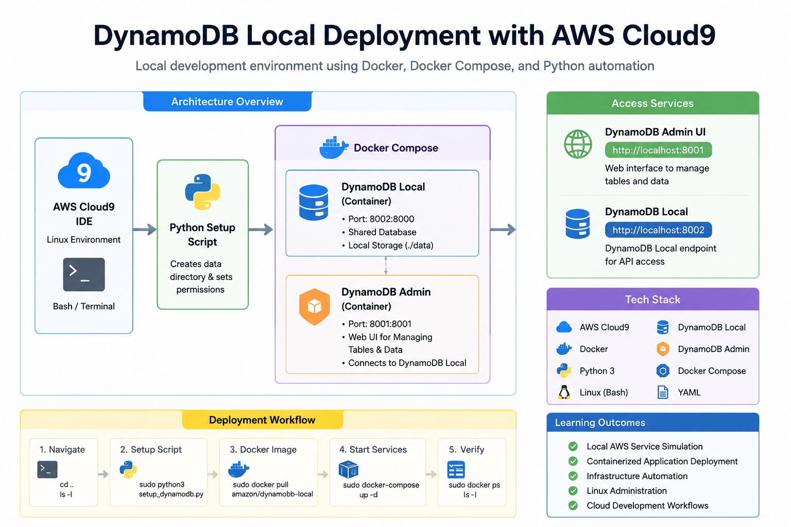

---

# ☁️ DynamoDB Local Deployment with AWS Cloud9

A hands-on AWS development project demonstrating how to deploy and manage **DynamoDB Local** inside an **AWS Cloud9 environment** using Docker, Docker Compose, Python automation, and Linux administration.

This project builds a **fully local cloud-like database environment** for development, testing, and learning without consuming AWS production resources.

---

# 🧠 Architecture Overview

<p align="center">
  
</p>

### 📌 System Flow

* AWS Cloud9 provides the development environment
* Python script prepares local storage permissions
* Docker Compose launches container services
* DynamoDB Local runs on port **8002**
* DynamoDB Admin UI runs on port **8001**
* Browser connects to services for database management and testing

---

# 🚀 Project Overview

This project walks through a complete local AWS-style database deployment including:

* AWS Cloud9 development environment setup
* DynamoDB Local container deployment
* DynamoDB Admin web interface
* Docker and Docker Compose orchestration
* Python automation for environment preparation
* Linux system configuration and permissions

---

# 🛠️ Technologies Used

* AWS Cloud9
* Amazon DynamoDB Local
* Docker
* Docker Compose
* Python 3
* Linux (Bash)
* YAML configuration

---

# 🎯 Skills Demonstrated

* Cloud development environments
* Infrastructure automation
* Containerized application deployment
* AWS service simulation
* Linux system administration
* Python scripting
* DevOps workflows

---

# 📋 Prerequisites

Ensure the following are installed in your Cloud9 environment:

* AWS Cloud9
* Docker
* Docker Compose
* Python 3
* Sudo privileges

Verify installation:

```bash
docker --version
docker-compose --version
python3 --version
```

---

# 📂 Step 1 — Navigate to Home Directory

```bash
cd ..
ls -l
```

Ensure you are in the correct working directory.

---

# 🐍 Step 2 — Python Setup Script

Create:

```text
setup_dynamodb.py
```

### Script:

```python
import os

def setup_dynamodb_local():
    dynamodb_data_path = "/home/dynamodb/data"

    try:
        os.makedirs(dynamodb_data_path, exist_ok=True)

        print(f"Directory created or already exists: {dynamodb_data_path}")

        os.chmod(dynamodb_data_path, 0o777)

        print(f"Permissions set to 777 for: {dynamodb_data_path}")

    except PermissionError:
        print("Permission denied. Run with elevated privileges.")

    except Exception as e:
        print(f"An error occurred: {e}")

if __name__ == "__main__":
    setup_dynamodb_local()
```

---

# 🐳 Step 3 — Docker Compose Configuration

Create:

```text
docker-compose.yml
```

```yaml
version: "3.8"

services:

  dynamodb-local:
    image: amazon/dynamodb-local:latest
    container_name: dynamodb-local
    command: "-jar DynamoDBLocal.jar -sharedDb -dbPath ./data"
    ports:
      - "8002:8000"
    restart: always
    volumes:
      - "./data:/home/dynamodblocal/data"
    working_dir: /home/dynamodblocal

  dynamodb-admin:
    image: aaronshaf/dynamodb-admin
    container_name: dynamodb-admin
    depends_on:
      - dynamodb-local
    restart: always
    ports:
      - "8001:8001"
    environment:
      - DYNAMO_ENDPOINT=http://dynamodb-local:8000
      - AWS_REGION=us-east-2
```

---

# ⚙️ Step 4 — Initialize Storage

```bash
sudo python3 setup_dynamodb.py
```

---

# 📦 Step 5 — Pull DynamoDB Image

```bash
sudo docker pull amazon/dynamodb-local
```

---

# ▶️ Step 6 — Start Services

```bash
sudo docker-compose up -d
```

---

# 🔍 Step 7 — Verify Deployment

```bash
sudo docker ps
ls -l
```

---

# 🌐 Access Services

| Service        | URL                                            |
| -------------- | ---------------------------------------------- |
| DynamoDB Admin | [http://localhost:8001](http://localhost:8001) |
| DynamoDB Local | [http://localhost:8002](http://localhost:8002) |

---

# 📊 Learning Outcomes

* AWS Cloud9 environment usage
* Local AWS service simulation
* Docker container orchestration
* Python automation scripting
* Linux permissions management
* DevOps-style deployment workflow

---

# 🏗️ Project Purpose

This project demonstrates how to build a **repeatable local AWS-like database environment** using modern DevOps tools.

It focuses on:

* Infrastructure automation
* Container-based deployment
* Cloud development simulation
* Safe local testing environments

---

# 👨‍💻 Author

**TCD_Overlord**

GitHub: [https://github.com/tcdoverlord](https://github.com/tcdoverlord)

---

# 📄 License

MIT License

---
